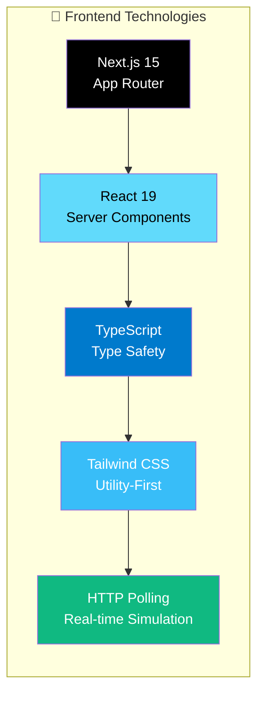
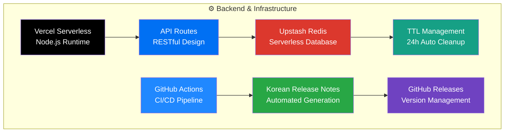
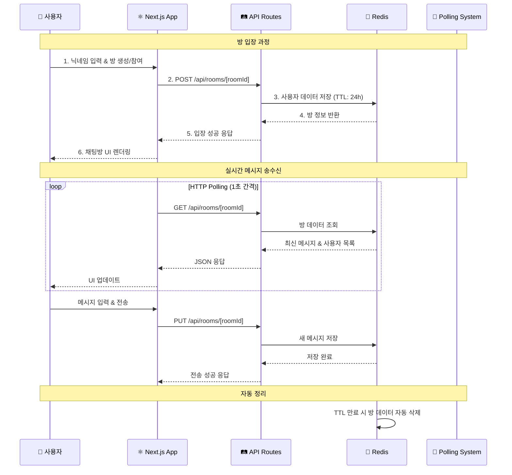
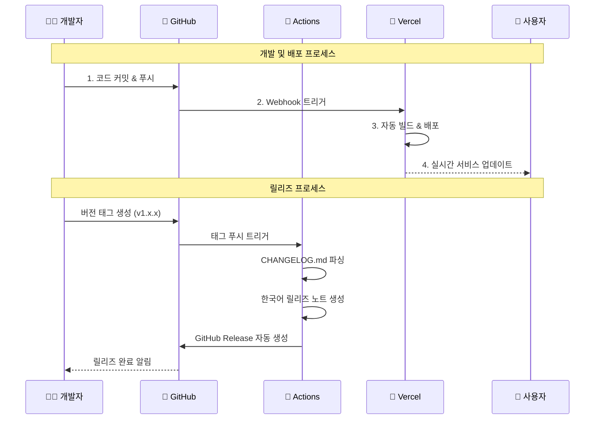

# 🏗️ Quad Chat 서비스 아키텍처

> 실시간 4인 채팅 애플리케이션의 전체 서비스 아키텍처와 기술 스택

## 📊 전체 시스템 아키텍처

```mermaid
graph TB
    %% 사용자 레이어
    subgraph "👥 사용자 접근점"
        PC[🖥️ PC 브라우저<br/>Chrome, Safari, Firefox]
        Mobile[📱 모바일 브라우저<br/>iOS Safari, Android Chrome]
        Tablet[📱 태블릿<br/>iPadOS, Android]
    end

    %% CDN 및 엣지 레이어
    subgraph "🌐 Vercel Edge Network"
        CDN[🚀 Global CDN<br/>Edge Locations]
        LoadBalancer[⚖️ Load Balancer<br/>Auto Scaling]
    end

    %% 프론트엔드 레이어
    subgraph "🎨 Frontend Layer"
        NextApp[⚛️ Next.js 15 App<br/>React 19 + TypeScript]
        TailwindCSS[🎨 Tailwind CSS<br/>Responsive Design]
        PWA[📱 PWA Support<br/>Mobile Optimized]
    end

    %% API 레이어
    subgraph "🔌 API Layer (Serverless)"
        APIRoutes[🛤️ API Routes<br/>/api/rooms/[roomId]]
        HTTPPolling[🔄 HTTP Polling<br/>1초 간격 실시간]
        CORS[🔐 CORS Handler<br/>Cross-Origin Support]
    end

    %% 데이터베이스 레이어
    subgraph "💾 Data Layer"
        Redis[(🔴 Upstash Redis<br/>Tokyo Region<br/>TTL: 24시간)]
        RedisOps[📝 Redis Operations<br/>GET/SET/DEL<br/>Room Management]
    end

    %% 개발 및 배포 워크플로우
    subgraph "⚙️ Development & Deployment"
        GitHub[🐙 GitHub Repository<br/>Source Code Management]
        Actions[🤖 GitHub Actions<br/>Korean Release Automation]
        VercelDeploy[🚀 Vercel Deployment<br/>Auto Deploy on Push]
    end

    %% 모니터링 및 관리
    subgraph "📊 Monitoring & Management"
        VercelAnalytics[📈 Vercel Analytics<br/>Performance Monitoring]
        RedisConsole[🔍 Upstash Console<br/>Database Monitoring]
        GHReleases[📋 GitHub Releases<br/>Korean Release Notes]
    end

    %% 연결 관계
    PC --> CDN
    Mobile --> CDN
    Tablet --> CDN

    CDN --> LoadBalancer
    LoadBalancer --> NextApp

    NextApp --> TailwindCSS
    NextApp --> PWA
    NextApp --> APIRoutes

    APIRoutes --> HTTPPolling
    APIRoutes --> CORS
    APIRoutes --> RedisOps

    RedisOps --> Redis

    GitHub --> Actions
    Actions --> GHReleases
    GitHub --> VercelDeploy
    VercelDeploy --> LoadBalancer

    NextApp -.-> VercelAnalytics
    Redis -.-> RedisConsole

    %% 스타일링
    classDef userLayer fill:#e1f5fe
    classDef edgeLayer fill:#f3e5f5
    classDef frontendLayer fill:#e8f5e8
    classDef apiLayer fill:#fff3e0
    classDef dataLayer fill:#ffebee
    classDef devopsLayer fill:#f1f8e9
    classDef monitorLayer fill:#fafafa

    class PC,Mobile,Tablet userLayer
    class CDN,LoadBalancer edgeLayer
    class NextApp,TailwindCSS,PWA frontendLayer
    class APIRoutes,HTTPPolling,CORS apiLayer
    class Redis,RedisOps dataLayer
    class GitHub,Actions,VercelDeploy devopsLayer
    class VercelAnalytics,RedisConsole,GHReleases monitorLayer
```

## 🔧 기술 스택 상세

### Frontend Stack


### Backend & Infrastructure


## 📡 데이터 플로우

### 실시간 채팅 플로우


### 배포 및 릴리즈 플로우


## 🏛️ 시스템 레이어 구조

### Layer 1: 사용자 인터페이스
```
🖥️ 브라우저 (Chrome, Safari, Firefox, Edge)
📱 모바일 (iOS Safari, Android Chrome)
📱 태블릿 (iPadOS, Android)
```

### Layer 2: CDN & Edge
```
🌐 Vercel Edge Network (Global)
⚖️ Load Balancer (Auto Scaling)
🚀 Edge Caching
```

### Layer 3: 애플리케이션
```
⚛️ Next.js 15 App Router
🎨 Tailwind CSS (Responsive)
📱 PWA Support
🔄 HTTP Polling Client
```

### Layer 4: API & Business Logic
```
🛤️ API Routes (/api/rooms/[roomId])
🔐 CORS Middleware
📝 Input Validation
🔄 HTTP Polling Server
```

### Layer 5: 데이터베이스
```
🔴 Upstash Redis (Tokyo)
⏰ TTL Management (24h)
📊 Room & Message Storage
```

## 📊 성능 및 확장성

### 성능 최적화
- **🚀 Vercel Edge**: 전 세계 CDN 분산 배치
- **⚡ HTTP Polling**: 1초 간격 최적화된 실시간성
- **💾 Redis TTL**: 24시간 자동 정리로 메모리 효율성
- **📱 모바일 우선**: 반응형 디자인 & PWA 지원

### 확장성 설계
- **🔄 Serverless**: 자동 스케일링 (0 → 무제한)
- **🌐 Global**: 다중 리전 분산 가능
- **📈 무료 티어**: Upstash Redis 일일 10,000 요청
- **💰 비용 효율**: 사용량 기반 과금

## 🔒 보안 아키텍처

### 데이터 보안
```
🔐 CORS Policy (Cross-Origin 제어)
📝 Input Validation (XSS 방지)
⏰ TTL 기반 데이터 자동 삭제
🚫 직접 DB 접근 차단
```

### 개발 보안
```
🛡️ Branch Protection Rules
👥 CODEOWNERS 권한 관리
🔍 PR 기반 코드 리뷰
🤖 자동화된 릴리즈 프로세스
```

## 📈 모니터링 & 관리

### 실시간 모니터링
- **📊 Vercel Analytics**: 성능 & 사용량 모니터링
- **🔍 Upstash Console**: Redis 사용량 & 성능 추적
- **📋 GitHub Actions**: 빌드 & 배포 상태 모니터링

### 로그 & 디버깅
- **🔍 Vercel Function Logs**: 서버리스 함수 로그
- **📱 Browser DevTools**: 클라이언트 사이드 디버깅
- **🔴 Redis Monitoring**: 데이터베이스 성능 추적

---

## 🎯 핵심 아키텍처 특징

✅ **서버리스 기반**: 무한 확장 가능성
✅ **실시간 통신**: HTTP Polling으로 안정적인 실시간성
✅ **글로벌 배포**: Vercel Edge Network 활용
✅ **자동화**: GitHub Actions 기반 CI/CD
✅ **한국어 우선**: 릴리즈 노트 자동 한국어 생성
✅ **모바일 친화**: PWA & 반응형 디자인
✅ **비용 효율**: 무료 티어 최대 활용

이 아키텍처는 **소규모 팀의 효율적인 개발**과 **글로벌 서비스 확장성**을 동시에 만족하는 현대적인 서버리스 아키텍처입니다! 🚀